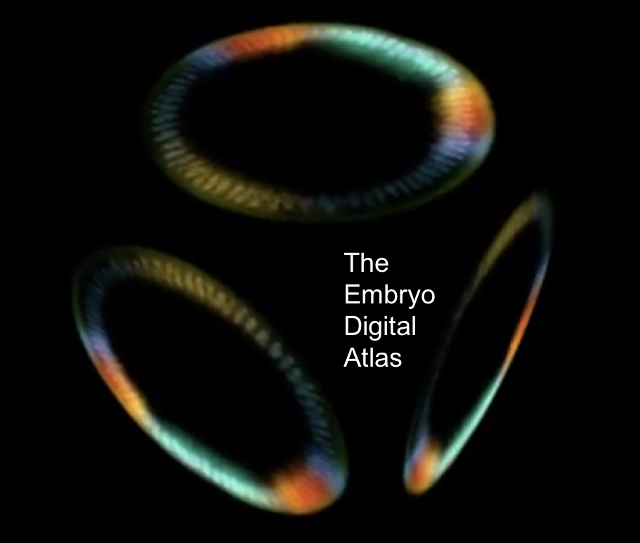

  

# The Embryo Digital Atlas

The Embryo Digital Atlas is a web based platform for curious citizens, students and scientists, to visualize complex experimental datasets of embryogenesis in an easy and beautiful way.

## Using The Embryo Digital Atlas

We foresee the following uses of our platform:

- Exploring complex datasets by varying time steps, changing modalities and colors, changing datasets, model organisms (fly, zebrafish, human embryos)

- Sharing knowledge about datasets and teaching each other by tagging images.

- Generating beautiful visualizations and exporting for publications or presentations.

## Current Users

[Shvartsman lab](http://shvartsmanlab.com/) at Princeton University

[Benny Shilo lab](http://shilolabweb.weizmann.ac.il/) at the Weizmann Institute

[Center for Data Arts](http://www.newschool.edu/center-for-data-arts/) at The New School

## Inspiration

Illustrations by Nobel Prize winner [Ramón y Cajal](https://www.newscientist.com/article/mg23331090-100-early-sketches-of-the-brain-show-ramn-y-cajals-artistic-genius/)

The beautiful [Wind Map](http://hint.fm/wind/) by Fernanda Viégas and Martin Wattenberg.

The Allen Cell Institute's [Cell Explorer](http://www.allencell.org/)

And [more](https://paulcinq.wordpress.com/about/data-driven-visualizations-of-embryogenesis/)

## Contribute

Want to contribute? Here is the [roadmap](https://github.com/paulvill/paulvill.github.io/issues/3) and here are the [contributor guidelines](CONTRIBUTING.md).

Join the [chat](https://gitter.im/embryo-digital-atlas/Lobby)

## Acknowledgments

We warmly thank the Shvartsman Lab, the Center for Data Arts, the Mozilla Science Lab, the MOZWOW 2017 cohort, Jérôme Le Lan.
