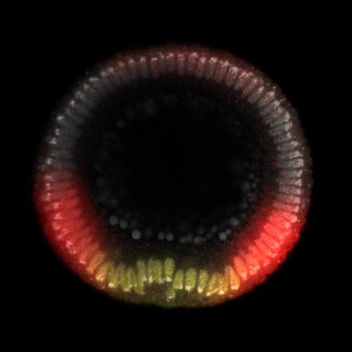

# Visualizing Developing Embryos

Why are we how we are? What makes each of us different? These questions are fascinating. If anywhere, the keys to their answers should lie in the process of embryogenesis, the process by which a single fertilized cell is turned into a multi-cellular organism. It is a really beautiful process, studied in various species, from the sea urchin, to the fruit fly, to the zebra fish, to the chicken, to the mouse, to the human.

Recent technological developments in microscopy imaging techniques have transformed embryology into a data intensive science. We present here a multi-modal data-driven visualization of a developing embryo, obtained from heterogeneous data fusion of static images.

Here is an example

<figure>
   
   <figcaption>Stained embryo with DAPI, dpERK, Dl</figcaption>
</figure>

More information about the science can be found <a href=" https://paulcinq.wordpress.com/ "> there </a>
